## Part 1. Installation of the OS

- Check Ubuntu version by running the command \
  `cat /etc/issue`

## Part 2. Creating a user

1. Add a screenshot of command call to create user. USE adduser!!!

2. The new user must be in the output of the command: \
  `cat /etc/passwd`

## Part 3. Setting up the OS network

##### Set the machine name as user-1

##### Set the time zone corresponding to your current location.

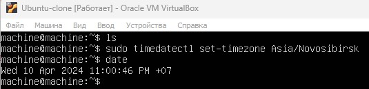

##### Output the names of the network interfaces using a console command.

A loopback device in Linux is a virtual device that can be used like any other media device.

##### Use the console command to get the ip address of the device you are working on from the DHCP server.

DHCP - Dynamic Host Configuration Protocol.

##### Define and display the external ip address of the gateway (ip) and the internal IP address of the gateway, aka default ip address (gw).

##### Set static (manually set, not received from DHCP server) ip, gw, dns settings (use public DNS servers, e.g. 1.1.1.1 or 8.8.8.8).

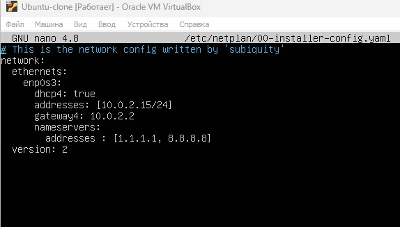

##### Reboot the virtual machine. Make sure that the static network settings (ip, gw, dns) correspond to those set in the previous point.

- Successfully ping 1.1.1.1 and ya.ru.

## Part 4. OS Update

## Part 5. Using the **sudo** command

##### Allow user created in [Part 2](#part-2-creating-a-user) to execute sudo command.

sudo (/suːduː/[4]) is a program for Unix-like computer operating systems that enables users to run programs with the security privileges of another user, by default the superuser. It originally stood for "superuser do", as that was all it did, and it is its most common usage; however, the official Sudo project page lists it as "su 'do' ". The current Linux manual pages for su define it as "substitute user", making the correct meaning of sudo "substitute user, do", because sudo can run a command as other users as well.

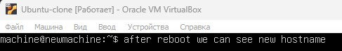

## Part 6. Installing and configuring the time service

##### Set up the automatic time synchronisation service.

- The output of the following command must contain `NTPSynchronized=yes`: \
  `timedatectl show`

## Part 7. Installing and using text editors

##### Install **VIM** text editor (+ any two others if you like **NANO**, **MCEDIT**, **JOE** etc.)

##### Using each of the three selected editors, create a *test_X.txt* file, where X is the name of the editor in which the file is created. Write your nickname in it, close the file and save the changes.

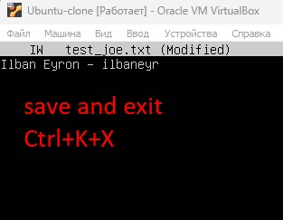

##### Using each of the three selected editors, open the file for editing, edit the file by replacing the nickname with the "21 School 21" string, close the file without saving the changes.

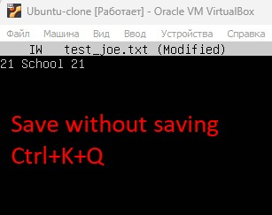

##### Using each of the three selected editors, edit the file again (similar to the previous point) and then master the functions of searching through the contents of a file (a word) and replacing a word with any other one.

## Part 8. Installing and basic setup of the **SSHD** service

##### Add an auto-start of the service whenever the system boots.

##### Reset the SSHd service to port 2022.

##### Show the presence of the sshd process using the ps command. To do this, you need to match the keys to the command.

##### Reboot the system.

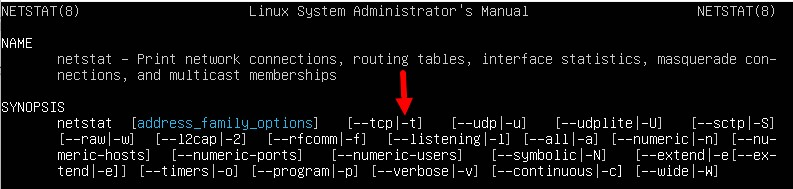

## Part 9. Installing and using the **top**, **htop** utilities

##### Install and run the top and htop utilities.

**top**

**htop**

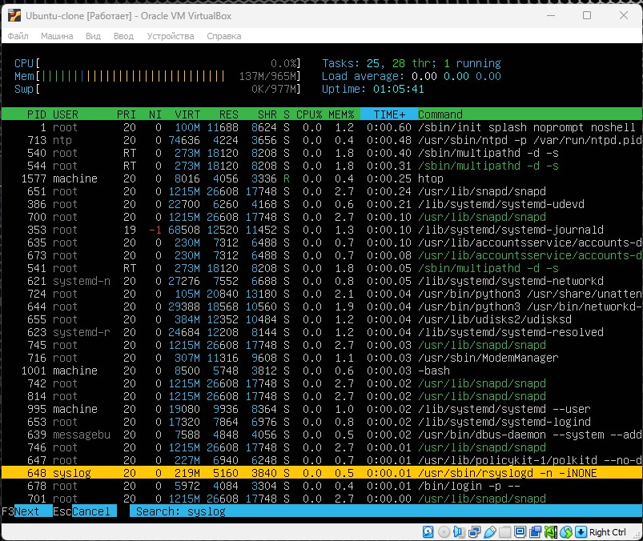

## Part 10. Using the **fdisk** utility

##### Run the fdisk -l command.

##### Run the swapon --show command.

## Part 11. Using the **df** utility

##### Run the df command.

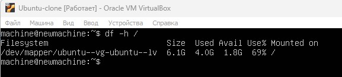

##### Run the df -Th command.

Ext4 is an advanced level of the ext3 filesystem which incorporates scalability and reliability enhancements for supporting large filesystems (64 bit) in keeping with increasing disk capacities and state-of-the-art feature requirements.

## Part 12. Using the **du** utility

##### Output the size of the /home, /var, /var/log folders (in bytes, in human readable format)

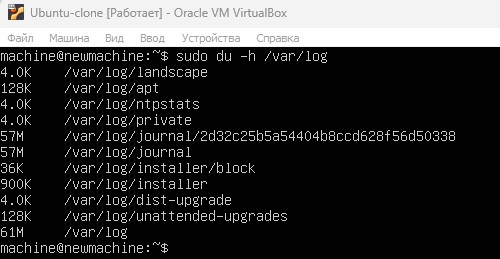

##### Output the size of all contents in /var/log (not the total, but each nested element using *)

## Part 13. Installing and using the **ncdu** utility

##### Output the size of the /home, /var, /var/log folders.

## Part 14. Working with system logs

##### 1. /var/log/dmesg

##### 2. /var/log/syslog

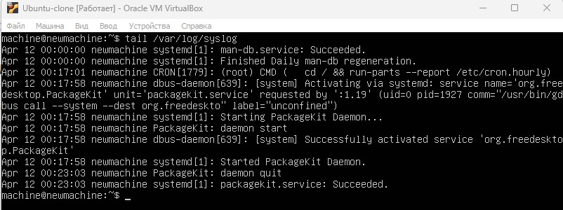

##### 3. /var/log/auth.log

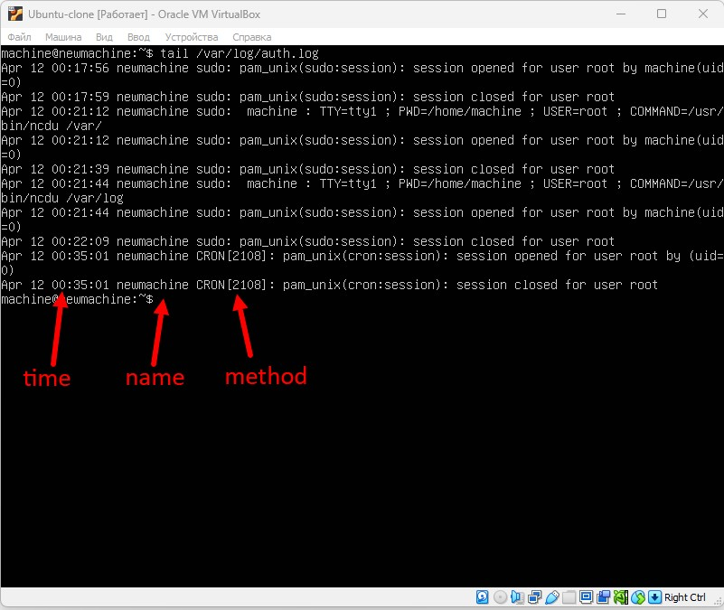

`sudo service ssh restart`

## Part 15. Using the **CRON** job scheduler

##### Using the job scheduler, run the uptime command in every 2 minutes.

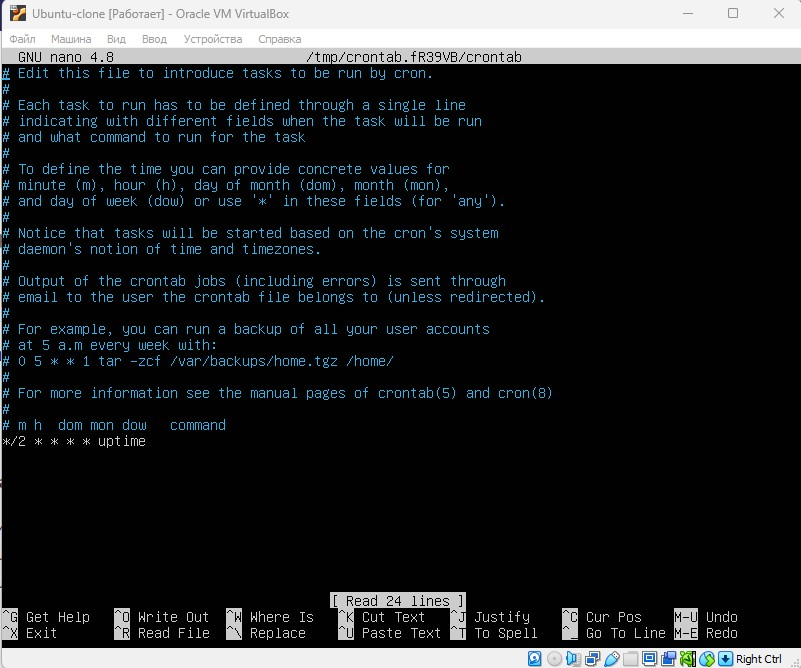

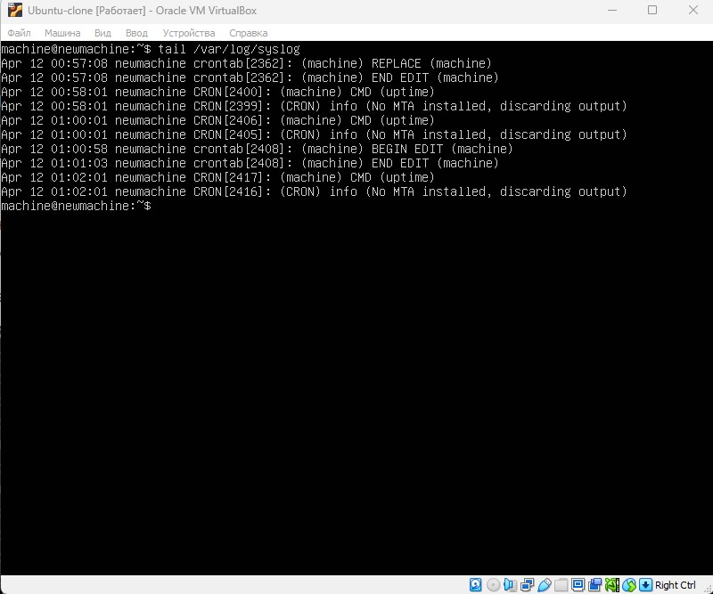

##### Remove all tasks from the job scheduler.

## THANK U 4 CHECKING

