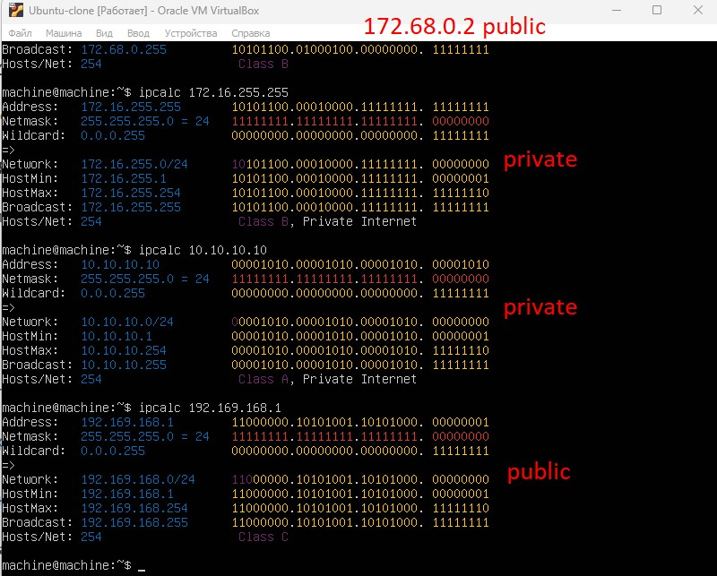
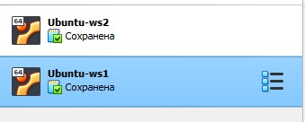
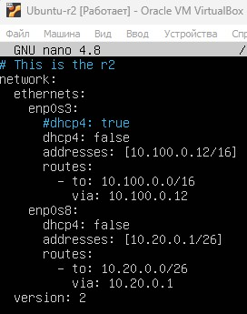
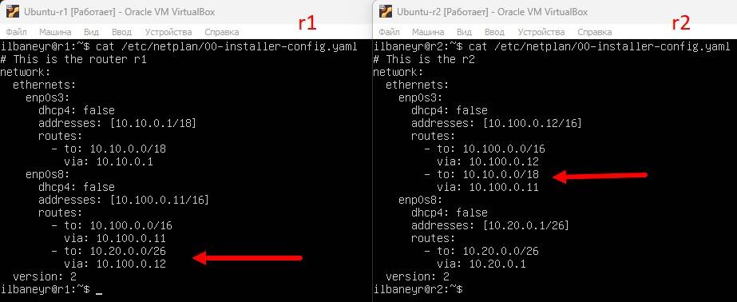

# Сети в Linux

## Part 1. Инструмент **ipcalc**

#### 1.1. Сети и маски

##### 1) Адрес сети *192.167.38.54/13*


##### 2) Перевод маски *255.255.255.0* в префиксную и двоичную запись, */15* в обычную и двоичную, *11111111.11111111.11111111.11110000* в обычную и префиксную


`-` В битовом виде ipcalc не примает маски


##### 3) Минимальный и максимальный хост в сети *12.167.38.4* при масках: */8*, *11111111.11111111.00000000.00000000*, *255.255.254.0* и */4*


#### 1.2. localhost
##### Определи и запиши в отчёт, можно ли обратиться к приложению, работающему на localhost, со следующими IP: *194.34.23.100*, *127.0.0.2*, *127.1.0.1*, *128.0.0.1*

`-` Localhost или локальный хост — это зарезервированное имя для частных IP-адресов. В случае, когда сеть представлена одним хостом, этот адрес определен как 127.0.0.1. Диапазон IP-аресов, предназначенных для создания локальных сетей: 127.0.0.1 - 127.255.255.255 (сеть 127.0.0.0/8).


#### 1.3. Диапазоны и сегменты сетей

- IP-адреса делятся на 5 классов (A, B, C, D, E). A, B и C — это классы коммерческой адресации. D – для многоадресных рассылок, а класс E – для экспериментов.

- Класс А: 1.0.0.0 — 126.0.0.0, маска 255.0.0.0
- Класс В: 128.0.0.0 — 191.255.0.0, маска 255.255.0.0
- Класс С: 192.0.0.0 — 223.255.255.0, маска 255.255.255.0
- Класс D: 224.0.0.0 — 239.255.255.255, маска 255.255.255.255
- Класс Е: 240.0.0.0 — 247.255.255.255, маска 255.255.255.255

##### 1) Какие из перечисленных IP можно использовать в качестве публичного, а какие только в качестве частных: *10.0.0.45*, *134.43.0.2*, *192.168.4.2*, *172.20.250.4*, *172.0.2.1*, *192.172.0.1*, *172.68.0.2*, *172.16.255.255*, *10.10.10.10*, *192.169.168.1*




##### 2) Какие из перечисленных IP адресов шлюза возможны у сети *10.10.0.0/18*: *10.0.0.1*, *10.10.0.2*, *10.10.10.10*, *10.10.100.1*, *10.10.1.255*


## Part 2. Статическая маршрутизация между двумя машинами

#### В VirtualBox можно создать и одновременно запустить несколько виртуальных машин. Эту функцию используют для тестирования нового ПО перед внедрением в рабочую среду или для экспериментов.

1. Чтобы создать сеть из виртуальных машин VirtualBox, выполните следующие шаги:

2. Нажмите «Файл» — «Инструменты» — «Менеджер сетей».

3. Перейдите во вкладку «Сети NAT».

4. Чтобы создать новую сеть NAT, нажмите на кнопку «Создать».

5. Кликните правой кнопкой мыши по машине, которую хотите добавить в сеть, и нажмите «Настроить».

6. Выберите тип подключения «Сеть NAT», имя созданной сети и нажмите «OK».

7. Повторите действия с 4 шага для всех устройств, которые хотите включить в сеть.

##### С помощью команды `ip a` посмотри существующие сетевые интерфейсы.


##### Опиши сетевой интерфейс, соответствующий внутренней сети, на обеих машинах и задать следующие адреса и маски: ws1 - *192.168.100.10*, маска */16*, ws2 - *172.24.116.8*, маска */12*. Выполни команду `netplan apply` для перезапуска сервиса сети.


#### 2.1. Добавление статического маршрута вручную
##### Добавь статический маршрут от одной машины до другой и обратно при помощи команды вида `ip r add`.
##### Пропингуй соединение между машинами.

Команда ip r add - добавляет ip в таблицу маршутизации.

`ip r add 192.168.100.10 dev enp0s3` dev - device; enp0s3 - interface


#### 2.2. Добавление статического маршрута с сохранением
##### Перезапусти машины. `reboot`
##### Добавь статический маршрут от одной машины до другой с помощью файла *etc/netplan/00-installer-config.yaml*.


##### Пропингуй соединение между машинами.


## Part 3. Утилита **iperf3**

Консольная утилита `iperf3` презначначена для того, чтобы измерять пропускную способность сети. Она поддерживает работу как по протоколу TCP, так и по UDP. Для проведения тестирования надо запустить iperf3 как на сервере, так и на клиенте. Клиентская часть будет генерировать трафик, а серверная - принимать и отбрасывать.

`iperf3` позволяет максимально загрузить канал между клиентом и сервером, что покажет его максимальную пропускную способность в конкретный момент.

#### При установке `iperf3` на одной машин возникала ошибка соединения с сайтом ubuntu. Можно исправить ее времено венрув все настройки в начальное состояние в */etc/netplan/00-installer-config.yaml*

#### 3.1. Скорость соединения
##### Перевод:
8 Mbps =  1 MB/s,
100 MB/s = 800000 Kbps,
1 Gbps = 1000 Mbps.

#### 3.2. Утилита **iperf3**
##### Измерь скорость соединения между ws1 и ws2.

Запуск серверной версии на ws1: `iperf3 -s`

Запуск клиентской версии происходит командой: `iperf3 -c 192.168.100.10`


## Part 4. Сетевой экран

#### 4.1. Утилита **iptables**
##### Создай файл */etc/firewall.sh*, имитирующий фаерволл, на ws1 и ws2:

`iptables -F - очистить все правила;`
`iptables -X - удалить цепочку;`
`iptables -A - добавить правило в цепочку;`
`iptables -D - удалить правило;`

##### Открой на машинах доступ для порта 22 (ssh) и порта 80 (http).

`iptables -A INPUT -p tcp --dport 22 -j ACCEPT`
`iptables -A INPUT -p tcp --dport 80 -j ACCEPT` - В этой команде `-p tcp` указывает на протокол (в данном случае TCP), `--dport 80` указывает на порт (в данном случае 22 или 80), а `-j ACCEPT` указывает, что все пакеты, соответствующие этому правилу, должны быть приняты.

##### Запрети *echo reply* (машина не должна «пинговаться», т.е. должна быть блокировка на OUTPUT).

##### Разреши *echo reply* (машина должна «пинговаться»).


##### Запусти файлы на обеих машинах командами `chmod +x /etc/firewall.sh` и `/etc/firewall.sh`.


- Разница в стратегиях заключается в том, что для первой машины мы сначала вводим правило заприщающее отвечать на запрос пинговаться, а для второй машины наоборот сначала вводим правило разрешающее пинговать. Поэтому в первом случае мы не можем пинговать машину, а во втором можем.

#### 4.2. Утилита **nmap**
##### Командой **ping** найди машину, которая не «пингуется», после чего утилитой **nmap** покажи, что хост машины запущен.


##### Сохрани дампы образов виртуальных машин
**P.S. Ни в коем случае не сохраняй дампы в гит!**



## Part 5. Статическая маршрутизация сети

Сеть: \


##### Подними пять виртуальных машин (3 рабочие станции (ws11, ws21, ws22) и 2 роутера (r1, r2)).

#### 5.1. Настройка адресов машин
##### Настрой конфигурации машин в *etc/netplan/00-installer-config.yaml* согласно сети на рисунке.

В виртуальных машинах для роутеров r1 и r2 задать два адаптера сети. см рис.


00-installer-config.yaml from ws11


00-installer-config.yaml from ws22


00-installer-config.yaml from ws21


00-installer-config.yaml from r1


00-installer-config.yaml from r2

`routes` - это набор правил, которые определяют, как трафик должен быть маршрутизирован в сети. Они могут указывать, какие IP-адреса должны быть маршрутизированы через определенный шлюз или интерфейс. `to` - к какому адресу, `via` - через какой адрес.

`gateway` - это IP-адрес шлюза по умолчанию, который используется для маршрутизации трафика в сеть. Это обычно IP-адрес маршрутизатора или другого устройства, которое может перенаправлять трафик между сетями.

##### Перезапусти сервис сети. Если ошибок нет, то командой `ip -4 a` проверь, что адрес машины задан верно. Также пропингуй ws22 с ws21. Аналогично пропингуй r1 с ws11.


ip -4 a from ws11


ip -4 a from ws22


ip -4 a from ws21


ip -4 a from r1


ip -4 a from r2


ping from ws11 to r1


ping from ws21 to ws22

#### 5.2. Включение переадресации IP-адресов
##### Для включения переадресации IP, выполни команду на роутерах:
`sysctl -w net.ipv4.ip_forward=1`


выполнение команды для r1


выполнение команды для r2

##### Открой файл */etc/sysctl.conf* и добавь в него следующую строку:
`net.ipv4.ip_forward = 1`


файл из r1


файл из r2

#### 5.3. Установка маршрута по-умолчанию
Пример вывода команды `ip r` после добавления шлюза:
```
default via 10.10.0.1 dev eth0
10.10.0.0/18 dev eth0 proto kernel scope link src 10.10.0.2
```
##### Настрой маршрут по-умолчанию (шлюз) для рабочих станций. Для этого добавь `default` перед IP роутера в файле конфигураций.
##### Вызови `ip r` и покажи, что добавился маршрут в таблицу маршрутизации.


файл ws11 `conf` вызов `ip r`


файл ws22 `conf` вызов `ip r`


файл ws21 `conf` вызов `ip r`

##### Пропингуй с ws11 роутер r2 и покажи на r2, что пинг доходит. Для этого используй команду:
`tcpdump -tn -i eth0`


вызов ping и tcpdump

#### 5.4. Добавление статических маршрутов
##### Добавь в роутеры r1 и r2 статические маршруты в файле конфигураций. Обратить внимание в какие сетевые интерфейсы добавляются маршруты!


*etc/netplan/00-installer-config.yaml* для каждого роутера.

##### Вызови `ip r` и покажи таблицы с маршрутами на обоих роутерах. Пример таблицы на r1:


`ip r` для каждого роутера.

##### Запусти команды на ws11:


вызов `ip r list 10.10.0.0/[маска сети]` и `ip r list 0.0.0.0/0` на ws11

- Для адреса 10.10.0.0 был выбран маршрут, который был задан в предыдущих шагах. Адрес 0.0.0.0/0 немаршрутизируемый адрес IPv4, который можно использовать в разных целях, в основном, в качестве адреса по умолчанию или адреса-заполнителя. Несмотря на то, что адрес 0.0.0.0 может использоваться в компьютерных сетях, он не является адресом какого-либо устройства.

#### 5.5. Построение списка маршрутизаторов
##### Запусти на r1 команду дампа:


вызов `tcpdump -tnv -i enp0s3` на r1

##### При помощи утилиты **traceroute** построй список маршрутизаторов на пути от ws11 до ws21.


вызов `traceroute 10.20.0.10` на r1

принцип работы построения пути при помощи **traceroute**: 1 - выходим на роутер 1; 2 - идем в общий Network (100.10.0.12); приходим в нужный хост ws21.

#### 5.6. Использование протокола **ICMP** при маршрутизации
##### Запусти на r1 перехват сетевого трафика, проходящего через eth0 с помощью команды:
`tcpdump -n -i eth0 icmp`
##### Пропингуй с ws11 несуществующий IP (например, *10.30.0.111*) с помощью команды:
`ping -c 1 10.30.0.111`


перехват и пропинговка

##### Сохрани дампы образов виртуальных машин.
**P.S. Ни в коем случае не сохраняй дампы в гит!**

## Part 6. Динамическая настройка IP с помощью **DHCP**

**== Задание ==**

##### Для r2 настрой в файле */etc/dhcp/dhcpd.conf* конфигурацию службы **DHCP**:
##### 1) Укажи адрес маршрутизатора по-умолчанию, DNS-сервер и адрес внутренней сети.

Установил сервис DHCPD командой `sudo apt install isc-dhcp-server`


настройка dhcpd.conf в r2

##### 2) В файле *resolv.conf* пропиши `nameserver 8.8.8.8`.


`nameserver 8.8.8.8` в resolv.conf в r2

##### Перезагрузи службу **DHCP** командой `systemctl restart isc-dhcp-server`. Машину ws21 перезагрузи при помощи `reboot` и через `ip a` покажи, что она получила адрес. Также пропингуй ws22 с ws21.


перезагрузил и проверил `isc-dhcp-server`


изображение полученного адреса и пинговки

##### Укажи MAC адрес у ws11, для этого в *etc/netplan/00-installer-config.yaml* надо добавить строки: `macaddress: 10:10:10:10:10:BA`, `dhcp4: true`.


etc/netplan/00-installer-config.yaml ws11

##### Для r1 настрой аналогично r2, но сделай выдачу адресов с жесткой привязкой к MAC-адресу (ws11). Проведи аналогичные тесты.


настройка dhcpd.conf в r1


`nameserver 8.8.8.8` в resolv.conf в r1


перезагрузил и проверил `isc-dhcp-server`


изображение полученного адреса и пинговки

##### Запроси с ws21 обновление ip адреса.


скрины ip до и после обновления.

`sudo dhclient -r` используется для сброса состояния DHCP-клиента на сетевом интерфейсе. Если конкретный интерфейс не указан, DHCP-клиент сбрасывается на всех интерфейсах. Далее, чтобы запросить обновление IP-адреса, нужно использовать команду `sudo dhclient` (можно с названием конкретного интерфейса, можно с опцией `-v`, для вывода подробной информации о процессе получения IP-адреса).

##### Сохрани дампы образов виртуальных машин.
**P.S. Ни в коем случае не сохраняй дампы в гит!**

## Part 7. **NAT**

##### В файле */etc/apache2/ports.conf* на ws22 и r1 измени строку `Listen 80` на `Listen 0.0.0.0:80`, то есть сделай сервер Apache2 общедоступным.
##### Запусти веб-сервер Apache командой `service apache2 start` на ws22 и r1.

*/etc/apache2/ports.conf - отвечает за порты, на которых работает apache*


Файлы */etc/apache2/ports.conf* на ws22 и r1. Запуск команды на ws22 и r1

##### Создал фаервол на r2, добавил следующие правила:
##### 1) Удаление правил в таблице filter - `iptables -F`;
##### 2) Удаление правил в таблице "NAT" - `iptables -F -t nat`;
##### 3) Отбрасывать все маршрутизируемые пакеты - `iptables --policy FORWARD DROP`.
##### ДАЛЕЕ: дал права на запуск `chmod +x /etc/firewall.sh` и запустил его `sudo /etc/firewall.sh`
##### ДАЛЕЕ: Проверяем соединение между ws22 и r1 командой `ping`.


##### Соединение отсутствует, как и должно быть.

##### Добавляем в `/etc/firewall.sh` ещё одно правило: `iptables -A FORWARD -p icmp -j ACCEPT` - разрешение маршрутизации всех пакетов протокола ICMP
##### ДАЛЕЕ: Проверяем соединение между ws22 и r1 командой `ping`.


##### ДАЛЕЕ: добавляем следующие правила в `/etc/firewall.sh`
`iptables -A FORWARD -p tcp -j ACCEPT` - разрешение маршрутизации всех пакетов протокола TCP
##### Включил **SNAT**, а именно маскирование всех локальных ip из локальной сети, находящейся за r2 (по обозначениям из Части 5 - сеть 10.20.0.0).
`iptables -t nat -A POSTROUTING -o enp0s3 10.20.0.0/26 -p tcp -j SNAT --to-source 10.100.0.12`
`-t` - ключ указывает используемую таблицу
`-o` (-out-interface) - исходящий интерфейс
`--to-source` - используется для указания адреса, присваиваемому пакету, теперь именно этот адрес будет указывать в качестве исходящего
##### Включил **DNAT** на 8080 порт машины r2 и добавить к веб-серверу Apache, запущенному на ws22, доступ извне сети.
`iptables -t nat -A PREROUTING -p tcp --dport 8080 -j DNAT --to-destination 10.20.0.20:80`
`-d (-dst, -destination)` - IP-адрес получателя
`-i (-in-interface)` - определяет входящий сетевой интерфейс
`-sport (-source-port)` - исходный порт, с которого был отправлен пакет
`-dport, (-destination-port)` - порт, или диапазон портов, на которые адресован пакет


изменённый файл

##### Проверяем соединение по TCP для **SNAT**: для этого с ws22 подключиться к серверу Apache на r1 командой:
`telnet 10.10.0.1 80`
##### Проверяем соединение по TCP для **DNAT**: для этого с r1 подключиться к серверу Apache на ws22 командой `telnet 10.100.0.12 8080` (обращаться по адресу r2 и порту 8080).


вызов команды telnet на ws22 и r1

##### Сохрани дампы образов виртуальных машин.
**P.S. Ни в коем случае не сохраняй дампы в гит!**

## Part 8. Дополнительно. Знакомство с **SSH Tunnels**

##### Запустил на r2 фаервол с правилами из Части 7.


запуск firewall

##### Запустил веб-сервер **Apache** на ws22 только на localhost (то есть в файле */etc/apache2/ports.conf* изменил строку `Listen 80` на `Listen localhost:80`).


запуск apache с изменениями

##### Воспользуйся *Local TCP forwarding* с ws21 до ws22, чтобы получить доступ к веб-серверу на ws22 с ws21.

`Local TCP forwarding` - локальное TCP-перенаправление
Удобно использовать в тех случаях, когда нужно направлять трафик между различными портами или узлами в пределах одной локальной сети.

##### В файлах на ws22, ws21, r1 и r2 /etc/ssh/sshd_config раскомментировал строку AllowTcpForwarding yes чтобы разрешить маршрутизацию по ssh


#### перезапустил ssh на машине ws22 и проверил прослушиваемые порты командой `netstat`
Использованные ключи команды `netstat`:

`t`: отображает только TCP-соединения, исключая UDP и другие протоколы
`u`: отображает только UDP-соединения
`l`: отображает только прослушиваемые порты, т.е. порты, на которых серверы слушают входящие соединения
`n`: отображает портов номера и IP-адреса в числовом формате, а не пытается выполнять обратное разрешение DNS для представления их символьных имен


#### создал локальный порт 2024 на ws21, для переадресации трафика через ssh на localhost:80 на ws22. Вызываю команду команду ssh -L 2024:localhost:80 10.20.0.20 на машине ws21


#### вводим yes, нажимаем enter, вводим пароль и вуа-ля мы на машине ws22 !!!


#### проверка командой `telnet 127.0.0.1 2024`


##### Воспользуйся *Remote TCP forwarding* c ws11 до ws22, чтобы получить доступ к веб-серверу на ws22 с ws11.

##### Remote TCP forwarding - удаленное TCP-перенаправление. Полезно, когда требуется перенаправлять трафик между узлами в разных сетях или подсетях, и доступ к этим узлам осуществляется через удаленный сервер.

#### Поскольку машины в разных сетях необходимо делать настройку через 2 узла: r1 и r2. Машина ws11 привязана к фиксированному адресу 10.10.0.9 через mac-адрес 10:10:10:10:10:BA (см. п. 6.2)
#### На машине ws11 в файле /etc/ssh/sshd_config раскомментировал строку `AllowTcpForwarding yes` чтобы разрешить маршрутизацию по ssh. Для работы удалённого перенаправления раскомментировал строку `GatewayPorts yes`.


#### Далее перезапуск и проверка статуса `sudo systemctl restart sshd` и `systemctl status sshd`


Для получения доступа к веб-серверу на ws22 с ws11 с помощью `Remote TCP forwarding` необходимо следующее:

#### Вспомнить пункт 7.6 ТЗ: Включить DNAT на 8080 порт машины r2 и добавил к веб-серверу Apache, запущенному на ws22, доступ извне сети, командой `iptables -t nat -A PREROUTING -p tcp --dport 8080 -j DNAT --to-destination 10.20.0.20:80`, следовательно, чтобы зайти на сервер apache2 извне сети нужно подключаться через порт 8080

#### Необходимый ключ команды ssh
`-R` (Remote Port Forwarding) работает в обратном направлении, позволяя устанавливать туннель между удаленной машиной и локальным хостом. Это позволяет перенаправлять трафик с удаленного порта на сервере на указанный локальный хост и порт. С ключом `-R` устанавливается проброска портов с удаленного сервера на клиентскую машину.

#### Remote TCP forwarding с ws22 на ws11. Вызов команды: `ssh -R 8080:10.20.0.20`


#### вводим yes, нажимаем enter, вводим пароль и вуа-ля мы на машине ws22 !!!


#### проверка командой `telnet 127.0.0.1 2024`


##### Сохрани дампы образов виртуальных машин.

##### Полезные ссылки оставил в [.](materials/usefull-links.txt)

##### СПАСИБО ЗА ПРОВЕРКУ!

